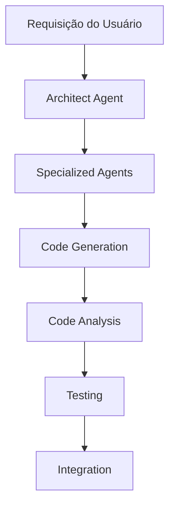
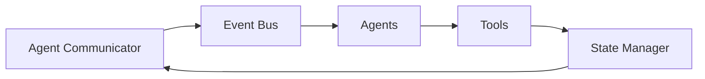
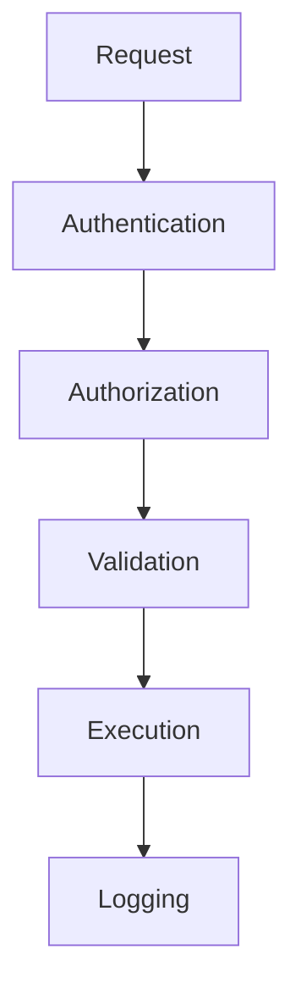
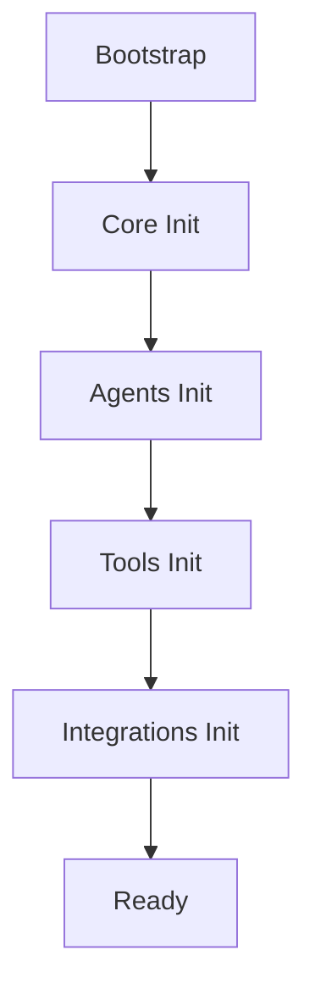
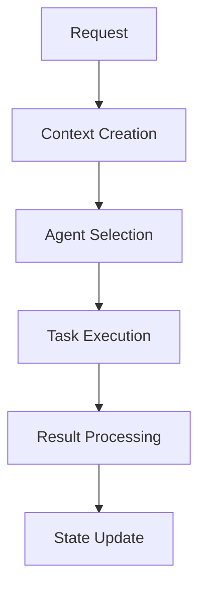

# 📐 Kallista - Guia de Arquitetura

## 🎯 Visão Geral da Arquitetura

O Kallista é construído sobre uma arquitetura modular baseada em agentes, utilizando o framework CrewAI como base. A arquitetura é dividida em camadas distintas que trabalham em conjunto para fornecer um ambiente completo de desenvolvimento.

## 🏗️ Camadas da Arquitetura

### 1. Core Layer
```
core/
├── management/           # Gerenciamento de estado e recursos
│   ├── state_manager.py
│   ├── memory_manager.py
│   └── context_manager.py
├── communication/        # Comunicação entre componentes
│   ├── agent_communicator.py
│   └── event_bus.py
└── logging/             # Sistema de logging
    └── logger.py
```

**Responsabilidades:**
- Gestão de estado do sistema
- Comunicação entre agentes
- Logging e monitoramento
- Gerenciamento de contexto
- Gestão de memória

### 2. Agents Layer
```
agents/
├── core/                # Agentes principais
│   ├── architect_agent.py
│   ├── development_agent.py
│   └── testing_agent.py
├── specialized/         # Agentes especializados
│   ├── wpf_agent.py
│   ├── database_agent.py
│   ├── uiux_agent.py
│   └── api_agent.py
└── support/            # Agentes de suporte
    ├── documentation_agent.py
    └── optimization_agent.py
```

**Responsabilidades:**
- Decisões arquiteturais
- Geração de código
- Análise de código
- Design de interface
- Design de banco de dados

### 3. Tools Layer
```
tools/
├── code/               # Ferramentas de código
│   ├── generator.py
│   └── analyzer.py
├── security/           # Ferramentas de segurança
│   ├── scanner.py
│   └── validator.py
├── performance/        # Ferramentas de performance
│   ├── profiler.py
│   └── optimizer.py
└── testing/           # Ferramentas de teste
    └── test_runner.py
```

**Responsabilidades:**
- Geração de código
- Análise de segurança
- Otimização de performance
- Execução de testes
- Validação de código

### 4. Integrations Layer
```
integrations/
├── visual_studio/      # Integração VS
│   ├── project_system.py
│   └── command_handler.py
├── github/            # Integração GitHub
│   └── github_client.py
├── azure/             # Integração Azure
│   └── azure_devops_client.py
└── nuget/             # Integração NuGet
    ├── package_manager.py
    └── feed_manager.py
```

**Responsabilidades:**
- Integração com IDEs
- Controle de versão
- CI/CD
- Gestão de pacotes
- Deploy

## 🔄 Fluxo de Dados

### 1. Fluxo de Desenvolvimento


### 2. Fluxo de Comunicação


## 🔌 Padrões de Integração

### 1. Event-Driven
```python
# Event Bus
class EventBus:
    async def publish(event: Event):
        # Publicação de eventos
        pass
        
    async def subscribe(event_type: str, handler: Callable):
        # Subscrição em eventos
        pass
```

### 2. Repository Pattern
```python
# Repository Base
class Repository:
    async def get(id: str):
        # Recuperação de dados
        pass
        
    async def save(entity: Any):
        # Salvamento de dados
        pass
```

## 📦 Gestão de Estado

### 1. Estado Global
```python
# State Manager
class StateManager:
    async def get_state():
        # Recuperação de estado
        pass
        
    async def set_state():
        # Atualização de estado
        pass
```

### 2. Memória de Agentes
```python
# Memory Manager
class MemoryManager:
    async def store():
        # Armazenamento em memória
        pass
        
    async def retrieve():
        # Recuperação de memória
        pass
```

## 🔒 Segurança

### 1. Camadas de Segurança
```
security/
├── authentication/     # Autenticação
├── authorization/      # Autorização
├── encryption/        # Criptografia
└── validation/        # Validação
```

### 2. Fluxo de Segurança


## 📊 Performance

### 1. Caching
```python
# Cache Manager
class CacheManager:
    async def get(key: str):
        # Recuperação de cache
        pass
        
    async def set(key: str, value: Any):
        # Armazenamento em cache
        pass
```

### 2. Resource Management
```python
# Resource Manager
class ResourceManager:
    async def allocate():
        # Alocação de recursos
        pass
        
    async def release():
        # Liberação de recursos
        pass
```

## 🔄 Ciclo de Vida

### 1. Inicialização


### 2. Execução


## 📈 Escalabilidade

### 1. Horizontal Scaling
- Múltiplas instâncias
- Load balancing
- Estado distribuído
- Cache distribuído

### 2. Vertical Scaling
- Otimização de recursos
- Gerenciamento de memória
- Thread pooling
- Cache local

## 🔧 Configuração

### 1. Hierarquia
```
config/
├── default.json       # Configurações padrão
├── development.json   # Ambiente de desenvolvimento
├── production.json    # Ambiente de produção
└── local.json        # Configurações locais
```

### 2. Exemplo
```json
{
    "agents": {
        "max_instances": 10,
        "timeout": 30000
    },
    "cache": {
        "type": "memory",
        "max_size": "1GB"
    },
    "security": {
        "encryption": "AES-256",
        "key_rotation": "7d"
    }
}
```

## 🔍 Monitoramento

### 1. Métricas
- CPU/Memory usage
- Cache hit/miss ratio
- Agent performance
- Response times
- Error rates

### 2. Logging
```python
# Logger configuration
{
    'version': 1,
    'handlers': {
        'console': {
            'class': 'logging.StreamHandler',
            'level': 'INFO'
        },
        'file': {
            'class': 'logging.FileHandler',
            'filename': 'kallista.log',
            'level': 'DEBUG'
        }
    }
}
```

## 📚 Considerações Arquiteturais

### 1. Extensibilidade
- Sistema de plugins
- Hooks personalizados
- Interfaces extensíveis
- Templates customizáveis

### 2. Manutenibilidade
- Código modular
- Baixo acoplamento
- Alta coesão
- Documentação completa

### 3. Confiabilidade
- Tratamento de erros
- Recuperação de falhas
- Backup e restore
- Validação de dados

---
Data de Atualização: 19/12/2024